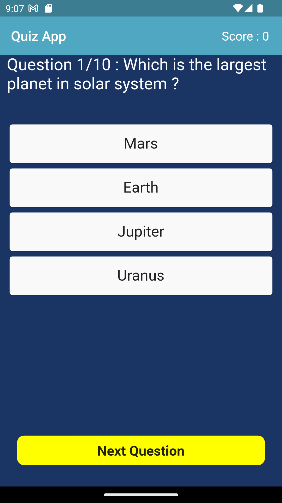
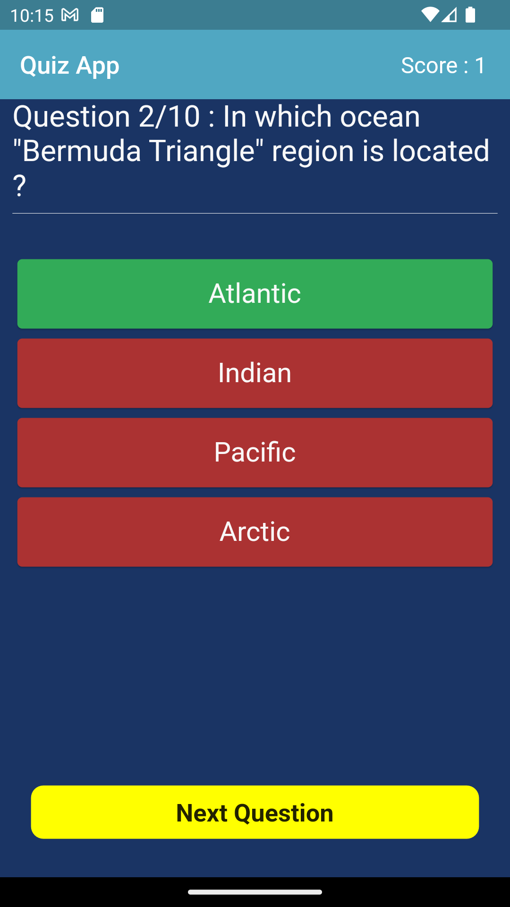
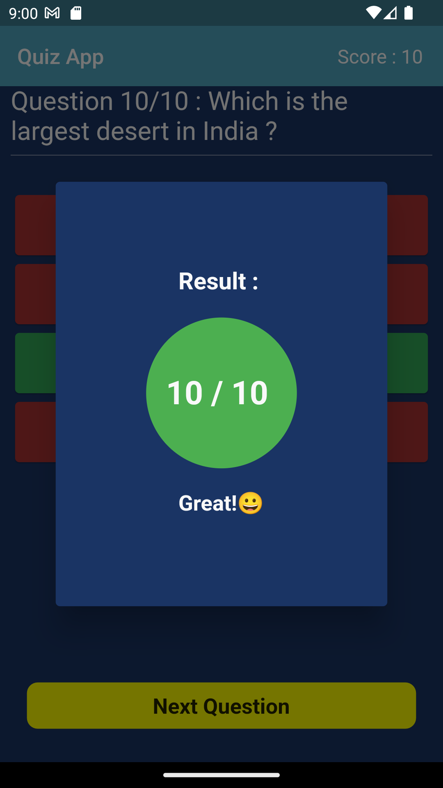
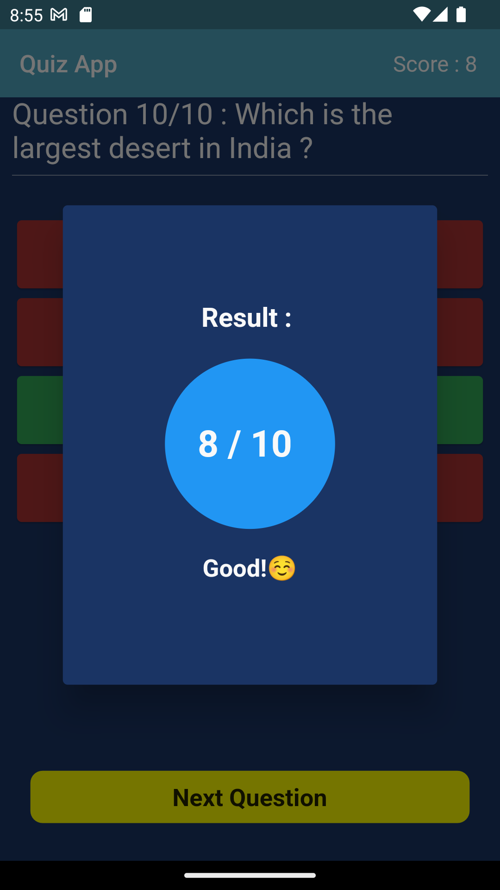
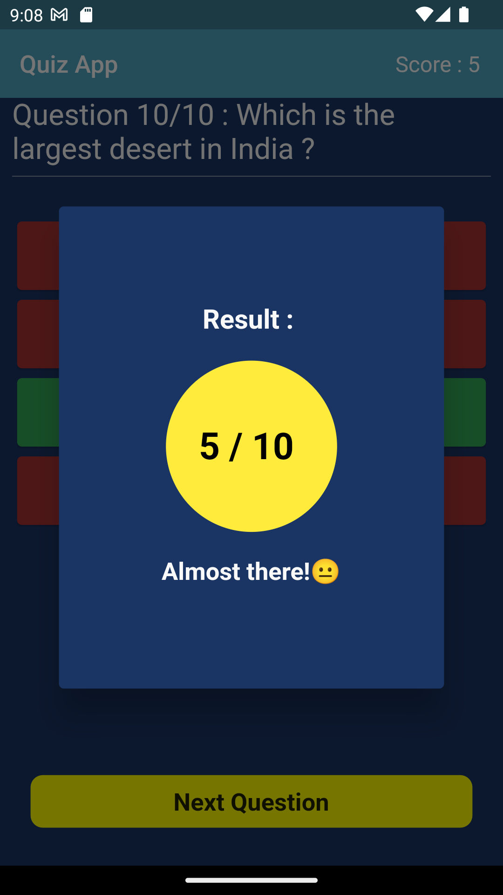
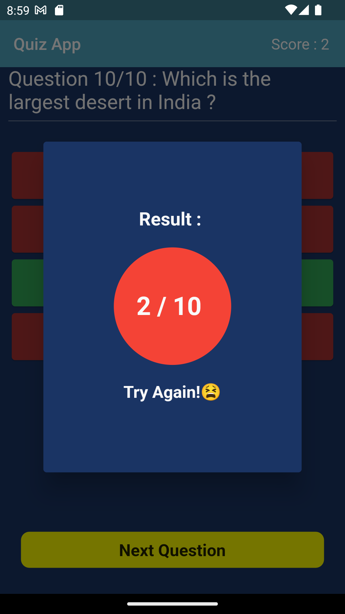

# Basic Quiz Application

## 🌟 Introduction 
 The Basic Quiz App is a simple yet engaging mobile application built using Flutter. This app allows users to participate in a quiz and test their knowledge on various topics. With its intuitive interface and interactive features, the Basic Quiz App offers an enjoyable learning experience for users of all ages.

## 📌 Features

**_The Quiz App offers the following features:_**

- **Question and Answer Format**: The app presents users with a series of multiple-choice questions, challenging them to select the correct answer from the provided options. This format encourages critical thinking and helps users reinforce their knowledge.

- **Colorful UI**: The app features a visually appealing user interface, with color-coded options that provide immediate feedback on the correctness of each answer. The selected option turns green if correct or red if incorrect, enhancing the user experience and facilitating comprehension.

- **Score Tracking**: As users progress through the quiz, the app keeps track of their score. The score is incremented for each correct answer, motivating users to strive for a higher score and rewarding their knowledge.

- **Result Display**: At the end of the quiz, the app displays the user's final score and provides feedback based on their performance. The result is presented within a colored circle, with different colors representing various score ranges. This visual representation, along with a corresponding message, adds a touch of gamification and encourages users to continue learning.

## 📸 Screenshots

 


## Results Display


### 1. Full Score Result



**Description:** This screenshot shows the result screen when the user achieves a full score of 10/10. The result is displayed inside a green color circle, indicating a great performance. The message "Great!😀" is shown below the score, congratulating the user on their perfect score.

### 2. More than Half Score Result



**Description:** This screenshot displays the result screen when the user scores more than half of the total points. The score is shown inside a blue color circle, representing a good performance. The message "Good!☺️" is displayed below the score, acknowledging the user's achievement.

### 3. Exactly Half Score Result



**Description:** This screenshot illustrates the result screen when the user scores exactly half of the total points. The score is presented inside a yellow color circle, indicating a near-average performance. The message "Almost there!😐" is shown below the score, encouraging the user to improve their score further.

### 4. Less than Half Score Result



**Description:** This screenshot showcases the result screen when the user scores less than half of the total points. The score is displayed inside a red color circle, representing a below-average performance. The message "Try Again!😫" is presented below the score, motivating the user to retake the quiz and strive for a better score.


## 👉 Prerequisites

Before running this project, make sure you have the following prerequisites set up on your system:
1. **Flutter SDK:** Follow the official Flutter installation guide to install Flutter on your machine: [Flutter Installation](https://flutter.dev/docs/get-started/install)
2. **Dart SDK:** Flutter relies on the Dart programming language, so make sure you have Dart SDK installed. It is typically installed automatically with Flutter.
3. **VS Code:** Download and install Visual Studio Code from the official website: [VS Code](https://code.visualstudio.com/) .

## ⬇️ Installation

### Clone the Repository:

```bash
git clone https://github.com/Arpitaagupta/Calculator-Flutter-Project.git
```


1.  **Open the Project in VS Code:**

* Launch Visual Studio Code.
* Click on `"File"` in the top menu and select `"Open Folder"`.
* Browse to the directory where you cloned the * repository and select the `"Calculator-Flutter-Project"` folder.
* The project will now open in VS Code.

2. **Install Dependencies:**

* Open the integrated terminal in VS Code by going to `"View"` in the top menu and selecting "Terminal" or by using the shortcut Ctrl+`` (backtick key).``
* Make sure the terminal's current directory is the root of your project.
* Run the following command to install the project dependencies:
```
flutter pub get
```

#### (i) Connect Your Device or Emulator:
* Connect your physical device to your computer via USB or start an emulator.
* Ensure that your device or emulator is detected by running the following command in the terminal:
``` 
flutter devices
```

#### (ii) Run the App:
* In the terminal, run the following command to start the app on your connected device or emulator:
```
flutter run
```
* Flutter will compile the code, build the app, and launch it on your device or emulator. You should be able to see and interact with your Flutter calculator app.


## 👤 Usage

1. Launch the app on your device or simulator.
2. Read each question carefully and select the answer you think is correct.
3. The selected option will turn green if correct, or red if incorrect, providing immediate feedback on your answer.
4. Tap the Next button to move to the next question and continue the quiz.
5. Repeat steps 2-4 for each question in the quiz.
6. At the end of the quiz, the app will display your final score and provide feedback based on your performance.


## 🤝 Contributing
Contributions are welcome!🤗 If you find any bugs or want to add new features, feel free to open an issue or submit a pull request. 


## 🪪 License
This project is licensed under the [MIT License](https://github.com/git/git-scm.com/blob/main/MIT-LICENSE.txt) .

Feel free to copy and paste the updated `README.md` code block to your file, including the added information about widgets, Scaffold, children, and optional parameters in Dart.


